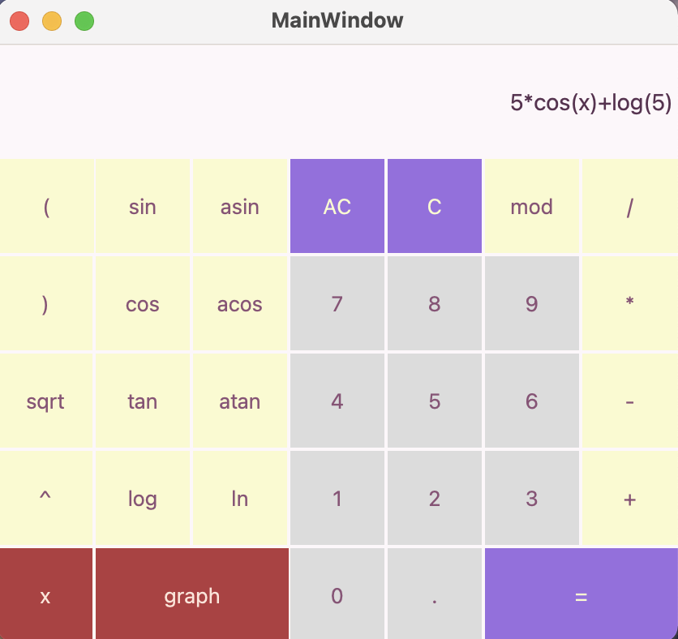
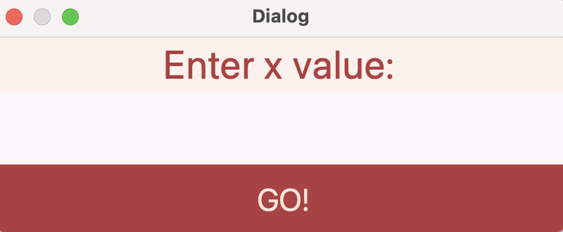
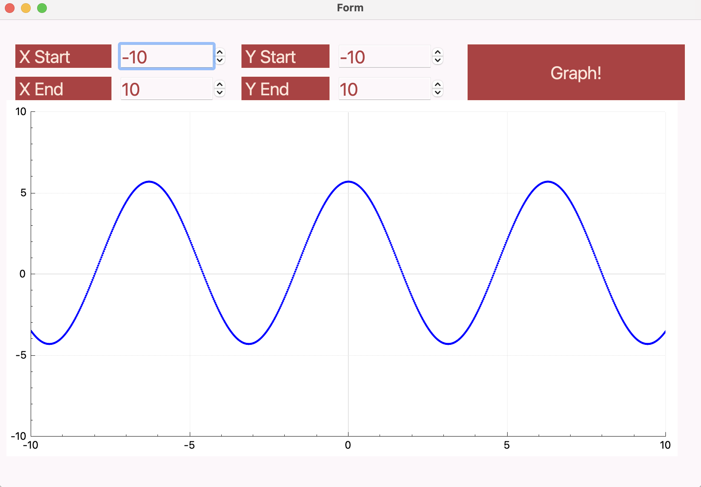

# SmartCalc v1.0

## Introduction

В данном проекте реализован на Си и Си++ расширенная версия обычного калькулятора, который можно найти в стандартных приложениях каждой ОС. Помимо базовых арифметических операций калькулятор поддерживает использование переменной x и построение графика соответствующей функции. Вычисления калькулятора проводятся на обратной польской нотациии.

## Реализация SmartCalc v1.0

- Программа разработана на языке Си стандарта C11 с использованием компилятора gcc. 
- Сборка программы настроена с помощью Makefile со стандартным набором целей для GNU-программ: all, install, uninstall, clean, dvi, dist, test, gcov_report.
- Программа разработана в соответствии с принципами структурного программирования
- Код придерживается Google Style
- Обеспечено покрытие unit-тестами модулей, связанных с вычислением выражений (файлы *.c), с помощью библиотеки Check 
- Реализация с графическим пользовательским интерфейсом на базе GUI-библиотеки с API - Qt
- На вход программы могут подаваться как целые числа, так и вещественные числа, записанные через точку
- Вычисление должно производиться после полного ввода вычисляемого выражения и нажатия на символ `=`
- Вычисление произвольных скобочных арифметических выражений в инфиксной нотации
- Вычисление произвольных скобочных арифметических выражений в инфиксной нотации с подстановкой значения переменной _x_ в виде числа
- Построение графика функции, заданной с помощью выражения в инфиксной нотации с переменной _x_  (с координатными осями, отметкой используемого масштаба и сеткой с адаптивным шагом)
    - Пользователю не предоставляется возможность менять масштаб
- Область определения и область значения функций ограничиваются по крайней мере числами от -1000000 до 1000000
    - Для построения графиков функции необходимо дополнительно указывать отображаемые область определения и область значения
- Проверяемая точность дробной части - 6 знаков после запятой
- Скобочные арифметические выражения в инфиксной нотации поддерживают следующие арифметические операции и математические функции:
    - **Арифметические операторы**:

        | Название оператора | Инфиксная нотация   (Классическая) | Префиксная нотация   (Польская нотация) |  Постфиксная нотация   (Обратная польская нотация) |
        | ------ | ------ | ------ | ------ |
        | Скобки | (a + b) | (+ a b) | a b + |
        | Сложение | a + b | + a b | a b + |
        | Вычитание | a - b | - a b | a b - |
        | Умножение | a * b | * a b | a b * |
        | Деление | a / b | / a b | a b \ |
        | Возведение в степень | a ^ b | ^ a b | a b ^ |
        | Остаток от деления | a mod b | mod a b | a b mod |
        | Унарный плюс | +a | +a | a+ |
        | Унарный минус | -a | -a | a- |
        

    - **Функции**:
  
        | Описание функции | Функция |   
        | ---------------- | ------- |  
        | Вычисляет косинус | cos(x) |   
        | Вычисляет синус | sin(x) |  
        | Вычисляет тангенс | tan(x) |  
        | Вычисляет арккосинус | acos(x) | 
        | Вычисляет арксинус | asin(x) | 
        | Вычисляет арктангенс | atan(x) |
        | Вычисляет квадратный корень | sqrt(x) |
        | Вычисляет натуральный логарифм | ln(x) | 
        | Вычисляет десятичный логарифм | log(x) |

# Интерфейс и Cборка на ПК

#### Требования к ОС и ПК:

- ОС только MacOS или Linux
- Установленный qmake для сборки проекта
- При желании генерации html-страницу с покрытием модульных тестов необходим установленный lcov и gcov (brew install lcov)

#### Непосредственная сборка на ПК

- Находясь в директории Smart_Calculator_Qt вводим в терминале make и ждем сборки примерно минуту
- Сборка осуществляется на рабочий стол
- При желании генерации html-страницу с покрытием модульных тестов вводим в терминале make gcov_report. Откроется страница в браузере с процентным покрытием строк кода
- При желании проверить код на его соответствие Google Style вводим make linter (если ничего не вывел - это значит все хорошо)
- При желании проверить код на утечки памяти вводим make leaks
- При желании почитать небольшую любительскую документацию вводии make dvi

#### В целом интерфейс имеет следующий вид:

Благодарю за интерес к проекту. Он выполнен в качестве задания в Школе 21 <3
